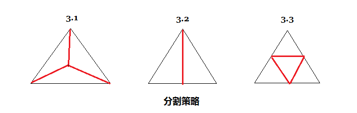

# 部分曲面细分的算法

## 算法概述：

### 1. 前提条件以及声明

```
    * 设所有的网格三角形序列为R，其中的某个元素为ex，代表一个三角面，如e1，e2，e3等；
    * 设某个元素ex，ex拥有的属性值：
        ex.id：ex在R中的索引值(下标)
        ex.v1, ex.v2, ex.v3：ex的三个顶点的属性，顶点属性有id，顶点坐标(x, y, z)。
    * 设给定的网格三角形集合为S，其中的某个元素为fx，代表一个三角面，如f1，f2，f3等；
    * 设某个元素fx，fx拥有的属性值：
        fx.id: fx在R中的索引值(下标)
        fx.v1, fx.v2, fx.v3：fx的三个顶点的属性，顶点属性有id，顶点坐标(x, y, z)。
        fx.e1, fx.e2, fx.e3：fx的三条边的属性，fx.e1所对的顶点为fx.v1，fx.e2所对的顶点为fx.v2，fx.e3所对的顶点为fx.v3，符合半边结构所规定的边所应有的属性，如起点终点的id，起点终点的坐标，长度len
        fx.opf1, fx.opf2, fx.opf3：fx的三个相邻面的id，相邻面为存在公共边，分别于fx.e1, fx.e2, fx.e3相对应，如果在S中，S的边缘的三角形的这三个属性可能存在空值，代表无邻面或者相邻面不在S中
    
    注意： 序列与集合并不是同一概念，半边结构，R可以通过读取.obj或者.stl等模型文件获得
```

### 2. 算法输入数据

```
    * 网格三角形序列R，选定的部分曲面的三角形集合S, 且S中的元素只有fx.id是存在的，其他属性需要在算法中计算
    * 算法结束后，S中最大三角形的面积maxs，即算法结束后，S中的最大三角形的面积将小于等于maxs
```

### 3. 算法执行步骤

```
    1，通过输入的R与S，将S的其他属性值进行计算：
        1.1，从R中取出一个元素设为f，如果f.id在S中，则继续；否则再次执行1.1对R进行遍历；
        1.2，使用f.v1, f.v2, f.v3计算出f.e1, f.e2, f.e3;
        1.3，使用f.e1, f.e2, f.e3在R中查到分别以这三条边为边的相邻面fx.opf1, fx.opf2, fx.opf3;
        1.4，将f保存到S中，替换S中只有f.id的元素。
    
    2，对S中的三角形进行细分，对于每个S中的每个面f，通过判断f的三条边的长度的比值，对f进行不同策略的分裂，
       f在分裂的同时将修改其相邻的面opf，opf也需要根据自己的边长比值进行不同策略的分裂：
       从S中取出一个元素，放入到队列queue中，对queue进行下面的步骤：
        2.1，判断queue是否为空，如果为空则结束2的算法，否则继续；
        2.2，取出queue队首元素f，f从queue中出队，如果f被标记为弃用，则执行步骤2.1，如果没有，则使用f的f.v1, f.v2, f.v3计算出f的面积，判断f是否小于maxs，如果是，则跳到2.1，否则继续；
        2.3，如果f的相邻的3个opf，存在1个为空，则设定opf所对应的f.e为不可分割边，进行3.1所描述的分割策略；
        2.4，如果f的相邻的3个opf，存在2个为空，则设定2个opf所对应的2条f.e为不可分割边，进行3.2所描述的分割策略；
        2.5，如果f的相邻的3个opf都存在，则计算f的三边的比例，并按照从大到小排列分别为1 : e1 : e2；
            2.5.1，如果满足条件：1<=e1<=2 && 1<=e2<=2，则进行3.3分割策略；
            2.5.2，如果满足条件：1<=e1<=2 && e2>2，则进行3.2分割策略；
            2.5.3，如果满足条件：e1>2 && e2>2，则进行3.1分割策略。
        2.6，将分割f以及f的相邻面opf产生的新的面newf依次添加到R与S中，然后将f与相邻面opf从R中标记为弃用；
    
    3，分割策略：
        3.1，计算出f的三角形中心cp，连接f的3个顶点，将f一分为三，f的opf不进行计算；
        3.2，如果从2.4进入，则设e2为f的唯一一条可分割边，则计算出e2的中点cp，连接e2所对的顶点f.v，将f一分为二，e2所对应的f的相邻面opf，进行2.3~2.5的步骤；
             如果从3.4进入，则设定f与fx的公共边为e2，计算e2的中点cp，连接e2所对应的顶点f.v将f一分为二，新分割的三角形不再进行处理；
        3.3，计算出f的三条边f.e的三个中点cp，连接3个cp，将f一分为四，f的三个相邻面opf进行3.1步骤进行分割，然后再进行3.4步骤；
        3.4，opf进入此步骤，将opf分割出的三个三角形中的直接与f相邻的三角形fx，进行3.2步骤。
```

### 3. 算法图示补充



### 4. 算法执行结果

```
    * 改变R中出现在S的元素，会增加新的元素到R中，并不会改变R中未出现在S中的元素；
    * 网格三角形R的渲染结果与之前相比较，曲面数量增加，但形状未改变，曲面变得细化。
```

---

## 算法优化：

```
    如果在算法执行前或者执行后对模型进行高斯平滑处理，则会产生更好的曲面细分效果。
```

---

## 算法替换：

```
    3.1的替换方案：计算f的中心cp可以为计算f的任意两个顶点到对边的垂线的交点cp，如果cp不在三角形中取在三角形中的垂线交点。
```

---

**关键字：**
*算法* 
*数据结构* 
*网格模型* 
*半边结构*